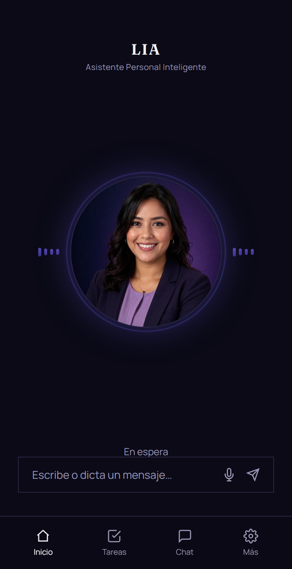
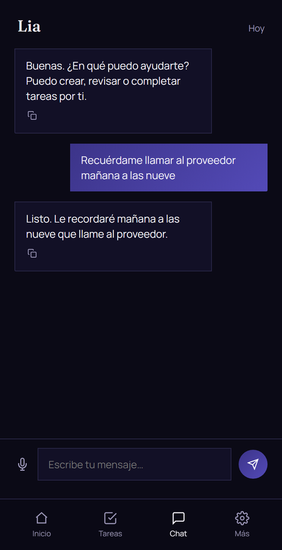
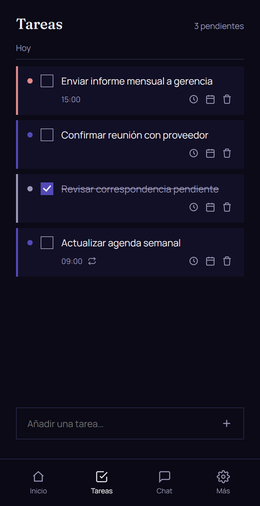
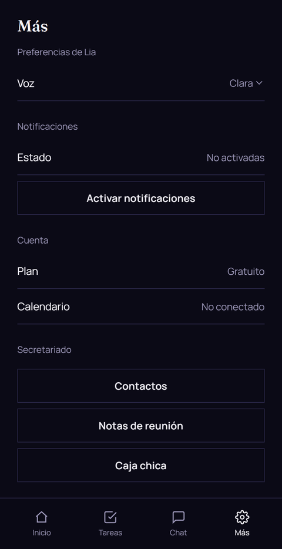
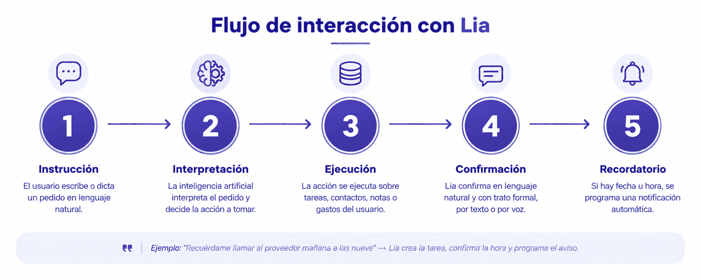
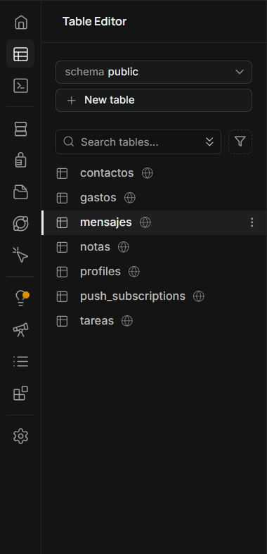

# PROYECTO DE INNOVACIÓN TECNOLÓGICA

## LIA, ASISTENTE PERSONAL INTELIGENTE PARA LA DIGITALIZACIÓN DE LAS FUNCIONES DEL SECRETARIADO EJECUTIVO MEDIANTE INTELIGENCIA ARTIFICIAL CONVERSACIONAL

---

## ÍNDICE

- Introducción
1. Justificación de la innovación
2. Objetivos
   - 2.1 Objetivo general
   - 2.2 Objetivo específico
3. Población beneficiaria
   - 3.1 Beneficiarios directos
   - 3.2 Beneficiarios indirectos
   - 3.3 Población beneficiaria académica
   - 3.4 Proyección de crecimiento
4. Esquema de diseño
   - 4.1 Interfaz del usuario
     - 4.1.1 Inicio
     - 4.1.2 Conversación
     - 4.1.3 Tareas
     - 4.1.4 Más
   - 4.2 Flujo de interacción
   - 4.3 Almacenamiento y notificaciones
     - 4.3.1 Almacenamiento de datos
     - 4.3.2 Notificaciones
   - 4.4 Metodología de desarrollo
5. Costos de diseño
   - 5.1 Costo de mano de obra
   - 5.2 Costo de materiales
   - 5.3 Costo de funcionamiento
   - 5.4 Resumen de costos totales
6. Mercado de comercialización
   - 6.1 Segmento de mercado
   - 6.2 Modelo de comercialización
   - 6.3 Canales de comercialización
7. Beneficios
   - 7.1 Beneficios para el usuario
   - 7.2 Beneficios para las organizaciones
   - 7.3 Beneficios económicos
8. Empresas competidoras
   - 8.1 Aplicaciones de gestión de tareas tradicionales
   - 8.2 Asistentes de voz genéricos
   - 8.3 Herramientas de agenda con inteligencia artificial
   - 8.4 Diferenciación de Lia
9. Estrategias de mejora y proyecciones
   - 9.1 Estrategias de mejora
   - 9.2 Proyecciones
     - 9.2.1 Escalamiento de infraestructura
     - 9.2.2 Expansión de mercado
     - 9.2.3 Crecimiento del plan institucional
     - 9.2.4 Reinversión en el producto
10. Conclusiones
11. Recomendaciones
12. Bibliografía

---

## INTRODUCCIÓN

En los últimos años, la inteligencia artificial ha dejado de ser una tecnología experimental para convertirse en una herramienta capaz de transformar la manera en que las personas organizan su vida cotidiana y su trabajo. La incorporación de modelos de lenguaje en aplicaciones de uso diario ha modificado la forma en que los usuarios se relacionan con la tecnología, desplazando progresivamente las interfaces basadas en menús, formularios y botones hacia interacciones más naturales, cercanas a una conversación humana. Este cambio de paradigma abre la posibilidad de repensar funciones que, hasta ahora, se habían desempeñado casi exclusivamente de forma manual o mediante herramientas informáticas tradicionales.

Dentro de esas funciones destaca el trabajo secretarial, que incluye la gestión de agendas, la organización de tareas por prioridad, el envío de recordatorios oportunos y la comunicación formal con quienes se atiende, actividades centrales en la formación de un secretariado ejecutivo. Tradicionalmente, estas labores se apoyan en herramientas informáticas que exigen que la persona interrumpa su actividad, abra la aplicación correspondiente y complete manualmente campos como el título, la fecha, la hora o la prioridad de cada pendiente. Este proceso, aunque sencillo en apariencia, introduce una dificultad constante que muchas veces provoca que los pendientes no se registren a tiempo, o se registren de forma incompleta, perdiendo así su utilidad práctica.

Frente a este panorama, surge la oportunidad de fusionar el conocimiento propio del secretariado ejecutivo con las capacidades actuales de la inteligencia artificial, de modo que sea la tecnología la que se adapte al usuario y no al revés. Bajo esta premisa se desarrolla **Lia, un asistente personal inteligente para la digitalización de las funciones del secretariado ejecutivo mediante inteligencia artificial conversacional**, capaz de crear, consultar, modificar y eliminar tareas y recordatorios, priorizarlos, programarlos y comunicar sus resultados con un trato formal, por texto o por voz, sin necesidad de formularios ni menús de navegación.

Lia se concibe como una aplicación web progresiva, instalable en el celular o la computadora como si fuera una aplicación nativa, accesible desde cualquier dispositivo con conexión a internet, que combina un modelo de inteligencia artificial capaz de ejecutar acciones reales sobre la información del usuario, un sistema de recordatorios oportunos mediante notificaciones automáticas, y una interfaz de entrada y salida por voz que permite dictar una tarea o escuchar la respuesta del asistente. El acceso a la aplicación se encuentra administrado mediante un sistema de roles, lo que la orienta hacia un uso real y controlado, y no únicamente hacia una demostración técnica.

El presente proyecto tiene como propósito exponer, de manera ordenada, los distintos aspectos que sustentan el desarrollo de Lia como una innovación tecnológica surgida desde el propio campo del secretariado ejecutivo.

---

## 1. JUSTIFICACIÓN DE LA INNOVACIÓN

El trabajo de un secretariado ejecutivo se sostiene, en gran medida, en tareas de organización: administrar una agenda, priorizar pendientes, programar recordatorios y comunicar todo ello con un trato formal y oportuno. La forma tradicional de apoyar estas labores, mediante agendas físicas, notas o aplicaciones de tareas convencionales, exige que la persona interrumpa su actividad, abra la aplicación correspondiente, navegue hasta la pantalla adecuada y complete manualmente campos como título, fecha, hora o prioridad. Esta dificultad provoca que numerosos pendientes no se registren, o se registren tarde, perdiendo así su utilidad. A esto se suma que la mayoría de estas herramientas son pasivas: almacenan lo que se escribe, pero no interpretan la intención de quien las usa, no distinguen una tarea urgente de una que puede esperar, ni son capaces de sostener una conversación de seguimiento, como consultar qué queda pendiente para el día o modificar una tarea ya existente sin volver a completar un formulario desde cero.

Lia responde a esta limitación fusionando el conocimiento propio del secretariado ejecutivo con un modelo de inteligencia artificial (Claude, de Anthropic) con capacidad de ejecutar acciones concretas y no solo de generar texto. Esta capacidad es la que marca la diferencia frente a un asistente conversacional convencional: el modelo no se limita a responder preguntas o a redactar texto, sino que interpreta la intención de quien le habla y la traduce en acciones reales sobre su base de datos de tareas, como crearlas, listarlas, modificarlas o eliminarlas, devolviendo además una confirmación en lenguaje natural y con el trato formal propio de una atención secretarial. De este modo, la inteligencia artificial deja de ser un simple canal de conversación y pasa a operar como la capa de control de la aplicación, ejecutando exactamente las funciones que un secretariado ejecutivo desempeñaría manualmente.

El carácter innovador del proyecto no reside en una sola funcionalidad aislada, sino en la articulación de varias tecnologías al servicio de una función profesional concreta, algo que no es habitual en un desarrollo de este alcance. Por un lado, el uso de un modelo de lenguaje capaz de ejecutar acciones concretas como interfaz principal de la aplicación, en lugar de tratarse como un complemento añadido a una interfaz tradicional ya existente. Por otro, la incorporación de entrada y salida por voz mediante las capacidades propias del navegador, lo que permite dictar una tarea o escuchar la respuesta de Lia sin necesidad de escribir ni leer, tal como ocurriría al dictarle un pendiente a un secretariado en persona. A ello se suma un sistema de recordatorios oportunos mediante notificaciones automáticas, capaz de avisar en el momento exacto solicitado, sin que la aplicación deba permanecer abierta ni la persona deba revisarla manualmente, reproduciendo así el seguimiento proactivo que se espera de una gestión secretarial eficiente.

Desde el punto de vista de la arquitectura, el proyecto aloja toda su lógica de funcionamiento en servicios en la nube, sin necesidad de administrar servidores propios, y se construye como una aplicación web progresiva, lo que le permite instalarse y funcionar como una aplicación nativa en el dispositivo del usuario, sin depender de una tienda de aplicaciones ni de un proceso de instalación tradicional. Esta combinación de estándares web modernos con un modelo de inteligencia artificial orientado a la acción constituye, en conjunto, una forma de innovación aplicada: no se trata de tecnologías nuevas en sí mismas, sino de su articulación coherente, guiada por un conocimiento profesional específico del área secretarial, dentro de un caso de uso concreto y cotidiano como es la gestión de una agenda.

Finalmente, el proyecto incorpora un modelo de acceso administrado, con roles de usuario y un panel de administración propio, lo que lo distingue de un simple prototipo o prueba de concepto. Esta decisión responde a la intención de que Lia pueda desplegarse y utilizarse en condiciones reales de uso, con control sobre quién accede a la aplicación y a la información que en ella se gestiona, aspecto que refuerza su viabilidad como una innovación tecnológica orientada a la implementación efectiva de una función secretarial digitalizada, y no únicamente a la demostración técnica.

---

## 2. OBJETIVOS

### 2.1 OBJETIVO GENERAL

Desarrollar Lia, un asistente personal inteligente para la digitalización de las funciones del secretariado ejecutivo mediante inteligencia artificial conversacional, capaz de gestionar una agenda, organizar tareas por prioridad, programar recordatorios y comunicarse con el usuario de manera formal, a través de una interacción en lenguaje natural, por texto o por voz.

### 2.2 OBJETIVO ESPECÍFICO

- Diseñar un sistema de gestión de tareas con título, fecha, hora exacta, prioridad y recurrencia, que reproduzca digitalmente la organización de una agenda secretarial.
- Integrar un modelo de inteligencia artificial capaz de interpretar las instrucciones del usuario en lenguaje natural y ejecutarlas como acciones reales sobre sus tareas: crearlas, listarlas, modificarlas o eliminarlas.
- Incorporar entrada y salida de voz, mediante reconocimiento y síntesis de voz, que permita dictar un pendiente y escuchar la respuesta de Lia, replicando la dinámica de dictado propia de la atención secretarial.
- Implementar un sistema de notificaciones automáticas oportunas, con resumen diario de pendientes y avisos a la hora exacta solicitada, que asegure un seguimiento proactivo similar al que ofrecería un secretariado ejecutivo.
- Establecer un modelo de acceso administrado por roles, con un panel de administración de usuarios, que garantice un uso controlado y seguro de la aplicación en condiciones reales.
- Incorporar la gestión de contactos, la redacción de correspondencia formal, el registro de notas y actas de reunión, y el control de caja chica, ampliando la digitalización a otras funciones propias del secretariado ejecutivo además de la agenda.
- Validar el funcionamiento de la aplicación mediante su implementación y uso efectivo, como evidencia práctica de la digitalización de funciones secretariales a través de la inteligencia artificial.

---

## 3. POBLACIÓN BENEFICIARIA

### 3.1 BENEFICIARIOS DIRECTOS

La población beneficiaria directa de Lia está conformada por personas que, en su vida profesional o personal, necesitan organizar una agenda propia o ajena: ejecutivos, profesionales independientes, pequeños empresarios, docentes y, de manera particular, secretarias y secretarios ejecutivos que desempeñan funciones de organización, seguimiento de pendientes y comunicación formal como parte central de su labor diaria. Para este último grupo, Lia no es solamente una herramienta de apoyo, sino la representación digital de las mismas competencias que su formación profesional les exige desarrollar: administrar el tiempo, priorizar tareas y mantener informado de manera oportuna a quien se atiende.

### 3.2 BENEFICIARIOS INDIRECTOS

Se benefician también, de forma indirecta, las personas y organizaciones que dependen del trabajo de quien utiliza Lia. Un ejecutivo cuya agenda es gestionada con apoyo de la aplicación recibe recordatorios más puntuales y una organización más consistente de sus actividades; una pequeña oficina o emprendimiento que no cuenta con personal administrativo dedicado encuentra en Lia una forma accesible de suplir esa función sin incurrir en el costo de contratar un puesto adicional. En ambos casos, el beneficio se traduce en menos pendientes olvidados, menos tiempo dedicado a tareas de organización manual y una comunicación más ordenada.

### 3.3 POBLACIÓN BENEFICIARIA ACADÉMICA

Dentro del ámbito académico, la población beneficiaria incluye también a estudiantes y egresados de la carrera de secretariado ejecutivo, para quienes Lia constituye un ejemplo aplicado de cómo su formación profesional puede complementarse con herramientas tecnológicas, ampliando su perfil hacia la gestión de este tipo de soluciones dentro de una organización.

### 3.4 PROYECCIÓN DE CRECIMIENTO

Finalmente, por tratarse de una aplicación de uso personal con control de acceso administrado, Lia está pensada para crecer de manera gradual: desde un primer grupo reducido de usuarios hasta, eventualmente, equipos de trabajo u oficinas completas que requieran una gestión de tareas y recordatorios compartida, sin que ello implique un cambio en su forma de uso, ya que la interacción seguirá dándose siempre mediante una conversación simple, por texto o por voz.

---

## 4. ESQUEMA DE DISEÑO

El diseño de Lia se organiza en tres capas que trabajan de forma coordinada: una interfaz visible para el usuario, un motor de inteligencia artificial que interpreta y ejecuta sus instrucciones, y un sistema de almacenamiento y notificaciones que conserva la información y avisa al usuario en el momento oportuno. Esta separación permite que cada parte cumpla una función clara dentro del funcionamiento general de la aplicación.

### 4.1 INTERFAZ DEL USUARIO

Lia se presenta como una aplicación de una sola pantalla que se organiza en cuatro secciones principales, a las que se accede mediante una barra de navegación inferior.

#### 4.1.1 INICIO

Es la pantalla principal y el primer contacto del usuario con Lia al abrir la aplicación. Muestra el nombre del asistente y su avatar dentro de un círculo animado, acompañado de barras de sonido a cada lado que reaccionan visualmente según el estado de Lia (en espera, escuchando, pensando o hablando), dando una referencia clara de qué está haciendo el asistente en cada momento. Debajo se encuentra un campo de texto único, con un botón de micrófono para dictar y otro para enviar, pensado para registrar una instrucción con la menor cantidad de pasos posible, ya sea escrita o hablada, sin necesidad de pasar primero por la pantalla de conversación.

**Figura 1**

*Pantalla de Inicio*

#### 4.1.2 CONVERSACIÓN

Es la pantalla donde se desarrolla el intercambio completo de mensajes con Lia, por texto o por voz, y donde se muestran sus respuestas con el trato formal propio de una atención secretarial. Cada mensaje del usuario y cada respuesta de Lia se presentan como burbujas diferenciadas por color, con el historial ordenado cronológicamente. Cuando Lia redacta una carta, un memorando o un correo formal, el usuario puede copiar el texto completo directamente desde la burbuja de respuesta mediante un botón dedicado, sin necesidad de seleccionarlo manualmente. Es también el canal a través del cual se ejecutan todas las acciones que Lia realiza sobre tareas, contactos, notas y gastos, ya que cualquier instrucción dada aquí puede traducirse en una acción real sobre esa información.

**Figura 2**

*Pantalla de Conversación*

#### 4.1.3 TAREAS

Es la pantalla donde se visualizan los pendientes ya registrados, agrupados por día y ordenados cronológicamente. Cada tarea se muestra en una tarjeta con un indicador de color según su prioridad (alta, media o baja), una casilla para marcarla como completada, y su título editable directamente sobre la pantalla, sin necesidad de abrir un formulario aparte. Cuando corresponde, se muestra además la hora del recordatorio y un ícono que señala si la tarea es recurrente. Al final de la lista hay una barra para añadir una tarea nueva de forma manual, como alternativa directa a pedírsela a Lia por conversación.

**Figura 3**

*Pantalla de Tareas*

#### 4.1.4 MÁS

Es la pantalla donde el usuario administra su cuenta y accede a las demás funciones secretariales de Lia. Incluye las preferencias del asistente (como la voz utilizada para leer las respuestas), el estado de las notificaciones y los datos generales de la cuenta. Desde aquí se accede también a Contactos, Notas de reunión y Caja chica, cada una con su propia pantalla de lista y creación manual, además de poder gestionarse por conversación con Lia. Un usuario administrador ve además, desde esta misma sección, un acceso adicional a un panel para gestionar las cuentas del resto de los usuarios.

**Figura 4**

*Pantalla de Más*

### 4.2 FLUJO DE INTERACCIÓN

El diseño de Lia sigue siempre el mismo recorrido, sin importar qué se le solicite, tal como se resume en la Figura 5: el usuario da una instrucción en lenguaje natural, la inteligencia artificial la interpreta y decide qué acción corresponde, esa acción se ejecuta sobre la información del usuario (una tarea, un contacto, una nota o un gasto), Lia confirma el resultado en lenguaje natural y con trato formal, y, si corresponde una fecha u hora específica, se programa de manera automática una notificación.

**Figura 5**

*Flujo de interacción con Lia*

### 4.3 ALMACENAMIENTO Y NOTIFICACIONES

#### 4.3.1 ALMACENAMIENTO DE DATOS

Toda la información que maneja Lia (tareas, contactos, notas, gastos, cuentas de usuario y el historial de conversaciones) se conserva en una base de datos en la nube, organizada en tablas independientes por tipo de información, en lugar de mezclar todo en una sola estructura. Cada tabla tiene asociado un control de acceso a nivel de fila, de modo que un usuario únicamente puede ver, crear, modificar o eliminar los registros que le pertenecen a él, sin posibilidad de acceder a la información de otra cuenta, ni siquiera de forma accidental. Esta separación por tipo de dato y por usuario es la que permite que funciones tan distintas como la agenda, los contactos, las notas de reunión y la caja chica convivan en la misma aplicación sin interferir entre sí, y es también la base que hace posible el modelo de acceso administrado descrito para el panel de administración.

**Figura 6**

*Tablas de la base de datos de Lia*

#### 4.3.2 NOTIFICACIONES

De forma paralela al almacenamiento, un servicio independiente revisa periódicamente las tareas pendientes del usuario para determinar si corresponde enviarle un aviso. Este servicio opera bajo dos modalidades complementarias: un resumen diario que agrupa los pendientes del día, enviado una vez por jornada, y un aviso puntual a la hora exacta que el usuario haya indicado para una tarea en particular, verificado cada pocos minutos para que el margen entre la hora solicitada y el aviso real sea mínimo. Ambas modalidades se entregan como notificaciones push del dispositivo, por lo que el usuario las recibe aunque no tenga la aplicación abierta en ese momento, replicando el seguimiento proactivo que se esperaría de un secretariado ejecutivo real.

Este esquema de diseño permite que la complejidad técnica de la aplicación permanezca completamente oculta para el usuario, quien únicamente percibe una conversación simple y natural, similar a la que sostendría con un secretariado ejecutivo.

### 4.4 METODOLOGÍA DE DESARROLLO

Lia se desarrolló mediante un proceso iterativo, apoyado en herramientas de inteligencia artificial para la programación (asistentes de código con inteligencia artificial), que permitieron construir la aplicación a partir de las decisiones tomadas por la autora del proyecto: qué funciones debía tener, cómo debía comportarse Lia frente a cada tipo de pedido, qué información necesita digitalizar un secretariado ejecutivo, y cómo debía sentirse la experiencia de uso final. La autora dirigió todo el proceso de desarrollo, definiendo los requerimientos de cada función, probando personalmente su funcionamiento en el navegador y en el celular, solicitando ajustes y correcciones cuando algo no funcionaba como se esperaba, tomando las decisiones de diseño visual y de redacción, y elaborando la documentación del proyecto, mientras la herramienta de inteligencia artificial se encargó de escribir el código correspondiente siguiendo esas instrucciones.

Este proceso se desarrolló en etapas sucesivas, en lugar de intentar construir la aplicación completa desde el inicio:

1. **Gestión básica de tareas.** Primero se implementó el registro de tareas con fecha, sin ningún otro atributo, para validar la estructura general de la aplicación.
2. **Conversación con inteligencia artificial.** Se incorporó el modelo de lenguaje con capacidad de ejecutar acciones reales sobre las tareas, reemplazando la idea original de un simple formulario.
3. **Atributos de la agenda.** Se agregaron prioridad, hora exacta y recurrencia a las tareas, junto con el sistema de notificaciones automáticas.
4. **Entrada y salida por voz.** Se incorporó el dictado y la lectura en voz alta de las respuestas, probando distintas voces hasta encontrar una cercana al español latinoamericano.
5. **Acceso administrado.** Se reemplazó el registro público de usuarios por un modelo de roles y un panel de administración, pensado para un uso real y controlado.
6. **Rediseño visual.** Se ajustó la identidad visual de Lia en varias rondas sucesivas, hasta llegar al avatar y las barras de sonido reactivas descritas en el punto 4.1.1.
7. **Ampliación a otras funciones secretariales.** Se incorporaron la gestión de contactos, las notas de reunión, la caja chica y la redacción de correspondencia formal, ampliando la digitalización más allá de la agenda.
8. **Documentación del proyecto.** De forma paralela al desarrollo, se elaboró y ajustó progresivamente el presente documento.

Cada etapa se validó antes de pasar a la siguiente, probando la función correspondiente en condiciones reales de uso y corrigiendo lo necesario, en lugar de dar por finalizado el desarrollo sin comprobar su funcionamiento.

---

## 5. COSTOS DE DISEÑO

Los costos del proyecto se organizan en tres grupos: el costo de mano de obra, correspondiente al tiempo de trabajo invertido en el desarrollo de la aplicación; el costo de materiales, correspondiente a los recursos utilizados para desarrollarla y probarla; y el costo de funcionamiento, correspondiente a los servicios en la nube necesarios para que Lia opere de manera continua.

### 5.1 COSTO DE MANO DE OBRA

El desarrollo de Lia representó una inversión de más de 150 horas de trabajo, distribuidas en las distintas etapas del proyecto y descritas en la metodología de desarrollo. Esta cifra corresponde al tiempo que la autora dedicó a dirigir el desarrollo: definir requerimientos, probar cada función, solicitar ajustes y validar el resultado, tal como se describió en el punto 4.4, y no a horas de programación manual. Valorizando ese tiempo a una tarifa referencial de Bs 80 por hora, se obtiene el siguiente detalle:

**Tabla 1**

*Costo de mano de obra*

| Etapa | Horas | Tarifa por hora | Costo estimado |
|---|---|---|---|
| Diseño de la aplicación (interfaz y experiencia de usuario) | 30 | Bs 80 | Bs 2.400 |
| Dirección del desarrollo (definición de requerimientos, pruebas y ajustes de funciones, base de datos y notificaciones) | 80 | Bs 80 | Bs 6.400 |
| Dirección de la integración de la inteligencia artificial y del reconocimiento y síntesis de voz | 25 | Bs 80 | Bs 2.000 |
| Pruebas, ajustes y corrección de errores | 20 | Bs 80 | Bs 1.600 |
| **Total costo de mano de obra** | **155** | | **Bs 12.400** |

Esta cifra debe entenderse como una estimación de referencia y no como un gasto monetario efectivamente desembolsado, ya que corresponde al trabajo propio invertido en el proyecto.

### 5.2 COSTO DE MATERIALES

Para el desarrollo, prueba y uso continuo de Lia se requirieron los siguientes recursos:

**Tabla 2**

*Costo de materiales*

| Concepto | Detalle | Costo estimado |
|---|---|---|
| Internet | Conexión utilizada durante el desarrollo, las pruebas y el uso diario de la aplicación | Bs 200 por mes |
| Celular | Equipo utilizado para probar el dictado por voz, las notificaciones y el uso general de la aplicación | Bs 1.500 (valor referencial del equipo) |
| Computadora | Equipo utilizado para la programación y el despliegue de la aplicación | Bs 4.500 (valor referencial del equipo) |
| **Total costo de materiales** | | **Bs 6.200** |

El celular y la computadora se presentan como valores referenciales del equipo utilizado y no como gastos recurrentes, dado que se trata de bienes que se emplean de forma continua y no de compras realizadas específicamente para este proyecto.

### 5.3 COSTO DE FUNCIONAMIENTO

Una vez en operación, Lia se apoya en servicios en la nube contratados bajo planes pagos, lo que garantiza mayor capacidad, estabilidad y respaldo frente a un plan gratuito, condición necesaria para un despliegue real y no solo para una demostración técnica:

**Tabla 3**

*Costo de funcionamiento*

| Concepto | Detalle | Costo estimado |
|---|---|---|
| Alojamiento de la aplicación (Vercel, plan Pro) | Suscripción mensual | Bs 138 por mes |
| Base de datos y funciones en la nube (Supabase, plan Pro) | Suscripción mensual | Bs 172 por mes |
| Modelo de inteligencia artificial (API de Claude, Anthropic) | Pago según cantidad de mensajes procesados | Bs 80 por mes (estimado, según uso) |
| Dominio propio | Registro anual, equivalente mensual | Bs 100 por año (aprox. Bs 8 por mes) |
| **Total costo de funcionamiento mensual** | | **Bs 398** |

Estos montos corresponden a un uso con un número reducido de usuarios. En caso de que Lia se adopte por un mayor número de personas, tanto el alojamiento como la base de datos podrían requerir un nivel de suscripción superior, al igual que el uso del modelo de inteligencia artificial aumentaría en proporción al número de mensajes procesados. Este escenario de crecimiento se desarrolla con mayor detalle más adelante, en las estrategias de mejora y proyecciones del proyecto.

### 5.4 RESUMEN DE COSTOS TOTALES

Integrando el total de cada uno de los tres cuadros anteriores, se obtiene la suma total de los costos del proyecto:

**Tabla 4**

*Resumen de costos totales*

| Cuadro | Total |
|---|---|
| 5.1 Costo de mano de obra | Bs 12.400 |
| 5.2 Costo de materiales | Bs 6.200 |
| 5.3 Costo de funcionamiento | Bs 398 |
| **Suma total** | **Bs 18.998** |

---

## 6. MERCADO DE COMERCIALIZACIÓN

### 6.1 SEGMENTO DE MERCADO

El mercado al que se dirige Lia está compuesto principalmente por profesionales independientes, ejecutivos, secretarias y secretarios ejecutivos, y pequeñas y medianas oficinas o emprendimientos que necesitan gestionar una agenda de forma constante, pero no siempre cuentan con personal administrativo dedicado o con el tiempo suficiente para hacerlo mediante herramientas tradicionales. Este segmento resulta especialmente relevante en un contexto en el que cada vez más profesionales trabajan de forma independiente o remota, y en el que la organización personal se ha vuelto una necesidad constante, sin que ello implique necesariamente contratar personal adicional.

### 6.2 MODELO DE COMERCIALIZACIÓN

Se propone un modelo de comercialización por suscripción mensual, con distintos planes según el número de usuarios que utilicen la aplicación dentro de una misma cuenta:

**Tabla 5**

*Planes de comercialización*

| Plan | Dirigido a | Precio mensual | Incluye |
|---|---|---|---|
| Personal | Un usuario individual | Bs 49 | Gestión de tareas, recordatorios por voz y texto, y notificaciones oportunas |
| Oficina | Equipos pequeños (hasta 5 usuarios) | Bs 199 | Todo lo del plan Personal, más un panel de administración de usuarios |
| Institucional | Organizaciones con un número mayor de usuarios | Precio a convenir según el número de cuentas | Todo lo del plan Oficina, más soporte y configuración dedicados |

Estos precios de referencia permiten cubrir el costo mensual de funcionamiento de la aplicación con un número reducido de suscriptores, y generar un margen adicional a medida que la cantidad de usuarios crece, dado que el costo de los servicios en la nube aumenta de forma proporcionalmente menor al número de personas que los utilizan.

### 6.3 CANALES DE COMERCIALIZACIÓN

La comercialización de Lia se plantea a través de una página de presentación (landing page): un sitio público, independiente de la aplicación, donde cualquier persona interesada puede conocer qué es Lia, para qué sirve y qué planes ofrece, antes de registrarse. Esta página funciona como punto de entrada común para el resto de los canales, ya que toda campaña de difusión necesita un lugar al que dirigir a las personas interesadas antes de pedirles que inicien sesión en la aplicación.

A partir de esa página de presentación, se plantean los siguientes canales de difusión y venta:

- **Sitio web propio**, al tratarse de una aplicación web progresiva, cualquier persona interesada puede acceder a ella e instalarla desde su celular o computadora sin pasar por una tienda de aplicaciones.
- **Redes sociales** orientadas a profesionales independientes y pequeñas empresas, como Facebook, Instagram y LinkedIn, mostrando casos de uso concretos de la aplicación.
- **Alianzas con institutos de formación** en secretariado ejecutivo y administración, que pueden recomendar Lia a sus estudiantes y egresados como una herramienta propia de su campo profesional.
- **Ferias de emprendimiento e innovación tecnológica**, tanto universitarias como locales, que sirven además como vitrina de presentación del proyecto.
- **Venta directa** a pequeñas oficinas, consultorios y emprendimientos que no cuentan con personal administrativo propio.
- **Publicación en una tienda de aplicaciones**, de forma opcional y en una etapa posterior, para dar mayor visibilidad y confianza a quienes prefieren buscar aplicaciones por ese medio.

---

## 7. BENEFICIOS

### 7.1 BENEFICIOS PARA EL USUARIO

Quien utiliza Lia deja de depender de formularios y menús para organizarse: basta con decir o escribir lo que necesita, en el momento en que lo necesita, sin interrumpir lo que está haciendo. Esto se traduce en menos pendientes olvidados o registrados fuera de tiempo, y en una agenda que se mantiene actualizada con mucho menos esfuerzo que con una herramienta tradicional. A esto se suma la posibilidad de dictar una tarea o escuchar la respuesta de Lia, lo que resulta especialmente útil cuando el usuario tiene las manos ocupadas o se encuentra en movimiento, y un sistema de notificaciones que le avisa de manera oportuna, sin que deba revisar la aplicación de forma manual. El mismo principio se extiende a sus contactos, sus notas de reunión y su caja chica, y a la redacción de correspondencia formal, que Lia entrega lista para copiar y usar.

### 7.2 BENEFICIOS PARA LAS ORGANIZACIONES

Una oficina, consultorio o emprendimiento que no cuenta con personal administrativo dedicado encuentra en Lia una forma accesible de contar con una función de organización y seguimiento de pendientes, sin necesidad de incorporar un puesto adicional. El sistema de acceso administrado permite, además, que un mismo responsable gestione a varios usuarios dentro de una misma cuenta, lo que facilita su adopción por equipos pequeños y no únicamente por una persona de forma individual.

### 7.3 BENEFICIOS ECONÓMICOS

Desde el punto de vista económico, el beneficio principal de Lia está en la diferencia entre su costo de suscripción y el costo de incorporar personal administrativo adicional, considerablemente más alto en el mercado boliviano que cualquiera de los planes de suscripción propuestos para Lia. A ese ahorro directo se suma un beneficio menos visible, pero igualmente relevante: el costo de los pendientes que se pierden u olvidan por una mala organización, como una cita reprogramada tarde o un pago no realizado a tiempo, que Lia ayuda a reducir mediante sus recordatorios oportunos.

---

## 8. EMPRESAS COMPETIDORAS

### 8.1 APLICACIONES DE GESTIÓN DE TAREAS TRADICIONALES

El mercado cuenta con aplicaciones de tareas ampliamente utilizadas, como Google Tasks, Microsoft To Do y Todoist. Se trata de herramientas sólidas y gratuitas o de bajo costo, pero que mantienen el esquema tradicional de formularios y menús: el usuario debe abrirlas, ubicar la sección correspondiente y completar manualmente cada pendiente. Ninguna de ellas está diseñada para sostener una conversación de seguimiento ni para interpretar instrucciones complejas expresadas en lenguaje natural.

### 8.2 ASISTENTES DE VOZ GENÉRICOS

Asistentes como Siri, Google Assistant o Alexa permiten crear recordatorios simples mediante comandos de voz. Sin embargo, son asistentes de propósito general, no orientados específicamente a la gestión de una agenda: no manejan prioridad ni recurrencia de forma detallada, no ofrecen un panel de administración de usuarios, y su interacción se limita a comandos puntuales antes que a una conversación sostenida con el trato formal propio de una atención secretarial.

### 8.3 HERRAMIENTAS DE AGENDA CON INTELIGENCIA ARTIFICIAL

En los últimos años han surgido también herramientas más recientes, como Motion o Reclaim.ai, orientadas a organizar automáticamente el calendario de un usuario mediante inteligencia artificial. Estas herramientas están dirigidas principalmente a un público internacional de habla inglesa, con planes de precio más elevados, y se enfocan en la programación automática del calendario más que en la conversación en lenguaje natural como forma principal de interacción.

### 8.4 DIFERENCIACIÓN DE LIA

Frente a estas alternativas, Lia se distingue por combinar en un mismo producto lo que, hasta ahora, ninguna de ellas ofrece en conjunto: una interacción completamente conversacional, por texto o por voz, capaz de ejecutar acciones reales sobre las tareas del usuario; un trato formal propio de una atención secretarial, coherente con el perfil profesional del que surge el proyecto; y un modelo de acceso administrado, pensado para pequeñas oficinas y equipos, a un costo notablemente menor que el de contratar personal administrativo adicional.

**Tabla 6**

*Comparación con empresas competidoras*

| Producto | Tipo | Limitación frente a Lia |
|---|---|---|
| Google Tasks / Microsoft To Do / Todoist | Aplicación de tareas tradicional | Requiere formularios y menús; no interpreta lenguaje natural |
| Siri / Google Assistant / Alexa | Asistente de voz genérico | No está orientado a la gestión de una agenda ni ofrece administración de usuarios |
| Motion / Reclaim.ai | Agenda con inteligencia artificial | Enfocado en programar el calendario automáticamente, no en la conversación; costo más elevado |
| **Lia** | Asistente conversacional secretarial | Conversación por texto y voz, acceso administrado, y trato formal, a bajo costo |

---

## 9. ESTRATEGIAS DE MEJORA Y PROYECCIONES

### 9.1 ESTRATEGIAS DE MEJORA

A partir de la versión actual de Lia, se plantean las siguientes mejoras a corto y mediano plazo:

- Desarrollar una página de presentación (landing page) que sirva como punto de entrada público del producto.
- Integrar Lia con calendarios externos de uso extendido, como Google Calendar, de modo que las tareas registradas se sincronicen automáticamente con la agenda que el usuario ya utiliza.
- Ampliar las funciones propias del trabajo secretarial que Lia puede asistir, como la redacción de correos o comunicados formales breves a partir de una instrucción del usuario.
- Publicar Lia en una tienda de aplicaciones, de forma complementaria a su acceso web, para ampliar su alcance y facilitar su instalación.
- Continuar perfeccionando la voz del asistente, incorporando nuevas opciones a medida que existan voces en español con mayor cercanía al acento regional del usuario.

### 9.2 PROYECCIONES

En cuanto a su proyección como producto, se contemplan los siguientes escenarios de crecimiento:

#### 9.2.1 ESCALAMIENTO DE INFRAESTRUCTURA

Conforme aumente el número de usuarios, los servicios en la nube que sostienen a Lia requerirán niveles de suscripción superiores a los actuales, un incremento de costo que resulta proporcionalmente menor al ingreso adicional generado por los nuevos suscriptores.

#### 9.2.2 EXPANSIÓN DE MERCADO

Al tratarse de una aplicación en español, con una arquitectura que no depende de infraestructura local, Lia tiene la posibilidad de expandirse más allá de Bolivia hacia otros países de habla hispana con necesidades similares de organización personal y profesional.

#### 9.2.3 CRECIMIENTO DEL PLAN INSTITUCIONAL

A medida que se sumen oficinas y organizaciones de mayor tamaño, el plan institucional se convierte en la principal fuente de crecimiento sostenido de ingresos, por encima de las suscripciones individuales.

#### 9.2.4 REINVERSIÓN EN EL PRODUCTO

Los ingresos generados por la comercialización de Lia se plantean como fuente de reinversión para continuar mejorando el modelo de inteligencia artificial que la sostiene y para incorporar las mejoras planteadas anteriormente.

---

## 10. CONCLUSIONES

El desarrollo de Lia demuestra que es posible fusionar el conocimiento propio del secretariado ejecutivo con las capacidades actuales de la inteligencia artificial, dando lugar a un asistente que no reemplaza el criterio profesional, sino que digitaliza y automatiza las funciones de organización, seguimiento y comunicación que forman parte central de esa profesión. Esta fusión constituye el eje que sostiene al proyecto como una innovación tecnológica aplicada, y no como el simple uso de una tecnología de moda desconectada de un problema real.

A lo largo del documento se evidenció que el proyecto responde a una necesidad concreta: la dificultad que introducen las herramientas tradicionales de organización personal, basadas en formularios y menús, frente a la naturalidad de una conversación por texto o por voz. El esquema de diseño construido permite que esa conversación se traduzca en acciones reales sobre las tareas del usuario, con recordatorios oportunos y un trato formal, replicando de manera efectiva la atención que ofrecería un secretariado ejecutivo.

En términos de viabilidad, se estableció que los costos de desarrollo y funcionamiento del proyecto son razonables y quedan cubiertos por un modelo de comercialización por suscripción, cuyo precio resulta considerablemente menor al costo de incorporar personal administrativo adicional. Frente a las alternativas existentes en el mercado, ya sean aplicaciones de tareas tradicionales o asistentes de voz genéricos, Lia se diferencia por combinar en un mismo producto la interacción conversacional, el trato formal y el modelo de acceso administrado, ninguno de los cuales se ofrece hoy en conjunto.

En conclusión, Lia se presenta como una propuesta de innovación tecnológica coherente, viable y sustentada en el conocimiento profesional del área de secretariado ejecutivo, capaz de aportar valor tanto a nivel personal como organizacional, y con una proyección clara de crecimiento y mejora continua.

---

## 11. RECOMENDACIONES

- **Realizar una prueba piloto con usuarios reales.** Antes de un lanzamiento comercial más amplio, se recomienda validar Lia con un grupo reducido de usuarios reales, idealmente compañeros y colegas del área de secretariado ejecutivo, para recoger su experiencia de uso y ajustar la aplicación con base en observaciones concretas y no solo en supuestos.

- **Formalizar el modelo de negocio antes de comercializar.** Los planes y precios presentados en este documento son referenciales; se recomienda revisarlos junto con un análisis legal y tributario formal antes de ofrecer Lia como un servicio pago a terceros.

- **Mantener una atención constante a la seguridad y privacidad de los datos.** A medida que Lia sume usuarios reales, se recomienda revisar de forma periódica los controles de acceso y el manejo de la información personal y de las tareas registradas, dado que se trata de datos sensibles de la vida profesional de cada usuario.

- **Recoger retroalimentación de forma continua.** Se recomienda establecer un canal simple para que los usuarios puedan reportar dificultades o sugerir mejoras, de modo que las estrategias de mejora planteadas en este documento se prioricen según necesidades reales y no únicamente según la visión inicial del proyecto.

- **Fomentar este tipo de proyectos desde la formación en secretariado ejecutivo.** Se recomienda a la institución educativa continuar impulsando proyectos que integren el área de formación con tecnologías emergentes, ya que representan un diferencial concreto para sus egresados frente a un mercado laboral cada vez más influenciado por la inteligencia artificial.

---

## 12. BIBLIOGRAFÍA

Anthropic. (2024). *Documentación de Claude*. https://docs.anthropic.com

Supabase Inc. (2024). *Documentación de Supabase*. https://supabase.com/docs

Vercel Inc. (2024). *Documentación de Vercel*. https://vercel.com/docs

Mozilla Foundation. (2024). *Web Speech API*. MDN Web Docs. https://developer.mozilla.org/es/docs/Web/API/Web_Speech_API

Mozilla Foundation. (2024). *Push API*. MDN Web Docs. https://developer.mozilla.org/es/docs/Web/API/Push_API

Google Developers. (2024). *Aplicaciones web progresivas*. web.dev. https://web.dev/explore/progressive-web-apps

*Nota: esta bibliografía cubre las fuentes técnicas consultadas para el desarrollo de Lia. Se recomienda complementarla con la literatura académica específica sobre competencias del secretariado ejecutivo y gestión administrativa utilizada durante la formación, dado que corresponde a fuentes propias del programa académico que el autor del proyecto puede referenciar con mayor precisión.*
